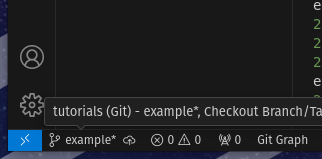
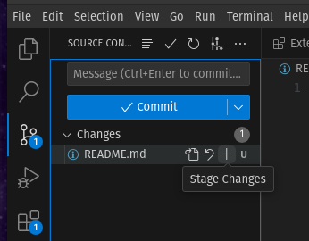
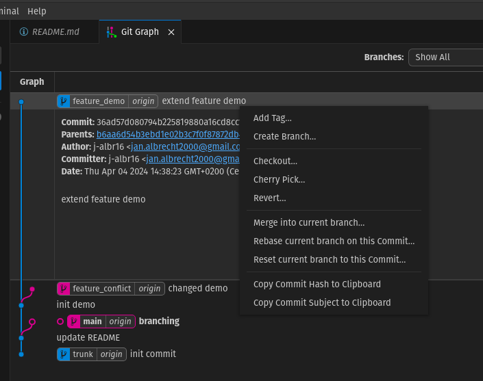
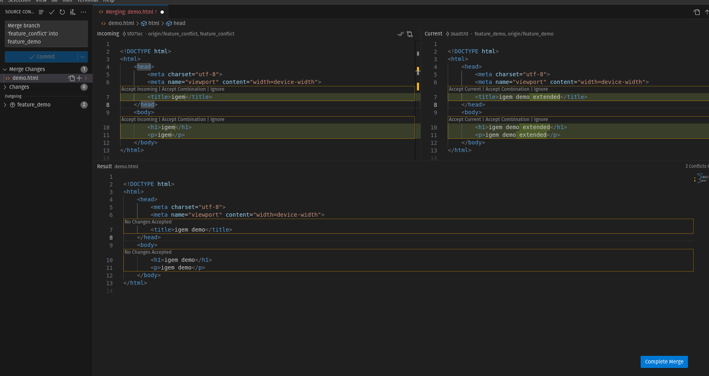

# Git Workshop

## VSCode

### Plugins

Installiere dir folgende Extensions für VSCode:

- Git Blame (wer hat was zuletzt geändert)
- Git Graph (zeigt dir den Verlauf deines Projekts)

## Installation

```bash
git clone https://j-albr16/igem-tutorials.git
```

### Basic Git Befehle

1. **Erstelle und wechsel zu einer neuen Branch**

In der command line kannst du folgenden Befehl verwenden:

```bash
git checkout -b <new-branch-name>
```

Klicke in VSCode auf das Branch Icon in der Status Bar und wähle dann *Create new branch* aus. Gebe den Namen der neuen branch ein und drücke Enter. Im Branch Icon sollte jetzt der neue Branch Name angezeigt werden.



In VSCode kannst du die Branches über das Source Control Panel wechseln. Klicke hierfür auf den Branch Namen und wähle dann die gewünschte branch aus.

2. **Erstelle ein File mit dem Namen `example.md`**

3. **Füge folgenden Text in das File ein:**

    ```markdown
    # Example

    This is an example file.
    ```

4. ***stage* das File**

Über die command line kannst du folgende Befehle verwenden:

```bash
git add example.md
```

In VSCode kannst du das File auch über das Source Control Panel *stagen*. Gehe hierführ in das Source Control Panel und klicke auf das `+` neben dem File.



5. ***commit* deine Änderungen**

```bash
git commit -m "Add example file"
```

In VSCode kannst du das File auch über das Source Control Panel *committen*. Gehe hierführ in das Source Control Panel und klicke auf das `✓` neben dem File. Du musst vorher eine commit message eingeben.

6. **Öffne den *git graph* und schaue dir den commit Verlauf an**

Im Terminal kannst du folgenden Befehl verwenden:

```bash
git log --oneline --graph
```

In VSCode kannst du den *git graph* öffnen und dir den Verlauf deines Projekts ansehen. Klicke hierfür auf das Git Graph Icon direkt über dem Commit Textfeld.

7. ***revert* den letzten commit**

```bash
git revert HEAD
```

Gehe in den Git Graph und klicke auf den letzten commit. Mache einen Rechtsklick und gehe dann auf *revert*.



8. ***reset* den revert**

Folgender Befehl setzt den letzten revert zurück:

```bash
git reset --hard HEAD~1
```

In VSCode kannst du den vorletzten commit im Git Graph auswählen und dann auf den *reset* Button klicken. Dann wird der revert zurückgesetzt.


> **Hinweis:** Die Verwendung der `--hard` Options beim reset Befehl ist gefährlich, da alle Änderungen verloren gehen. Verwende diesen Befehl nur, wenn du dir sicher bist, dass du alle Änderungen verwerfen möchtest. Wenn du dir nicht sicher bist, verwende `--soft` oder `--mixed`. Analoge optionen gibt es auch im Git Graph in VSCode.

9. ***push* deine Änderungen**

```bash
git push origin <branch-name>
```

oder 

```bash
git push --set-upstream origin <branch-name>
```

In VSCode kannst du auf das *push* Icon in der Status Bar klicken.

### Branching

1. **Erstelle einen neuen Branch `feature`**

2. **Erstelle ein File `feature_<branch_name>.md`**

3. **Füge folgenden Text in das File ein:**

    ```markdown
    # Feature

    This is a feature file.
    ```

4. **Committe deine Änderungen**

5. **Wechsle zurück zum `main` Branch**

in VSCode kannst du auf das Branch Icon in der Status Bar klicken und dann den `main` Branch auswählen.

6. **Merge den `feature` Branch in den `main` Branch**

```bash
git merge feature
```

in VSCode kannst du im Git Menü oben rechts auf die drei Punkte klicken, dann auf *Branch* und dann auf *Merge* klicken. Wähle den `feature` Branch aus.

> **Hinweis:** Du kannst in VSCode auch *CTR-SHIFT-P* drücken und einen befehl eingeben.

### Konflikte

1. **Wechsel zu der Branch `feature_demo`**
2. **Merge die Branch `feature_conflict` in die Branch `feature_demo`**

```bash
git merge feature_conflict
```

in VSCode kannst du den Merge auch über das Source Control Panel machen. Klicke hierfür auf den Merge Button.


3. **Löse den Konflikt**

Gehe in VSCode im Git Menü auf das File mit dem Konllikt und wähle den Konflikt Editor aus. Löse den Konflikt und speichere das File.



4. **Committe deine Änderungen**


